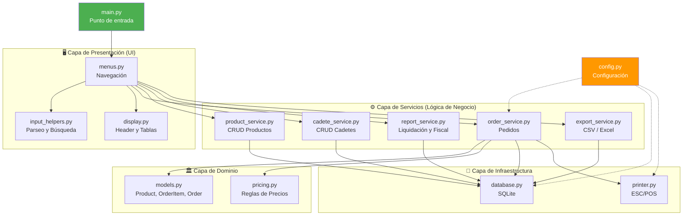
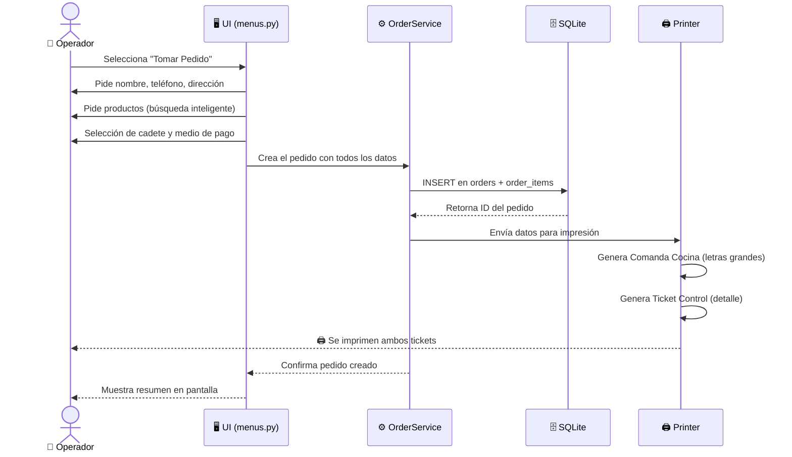
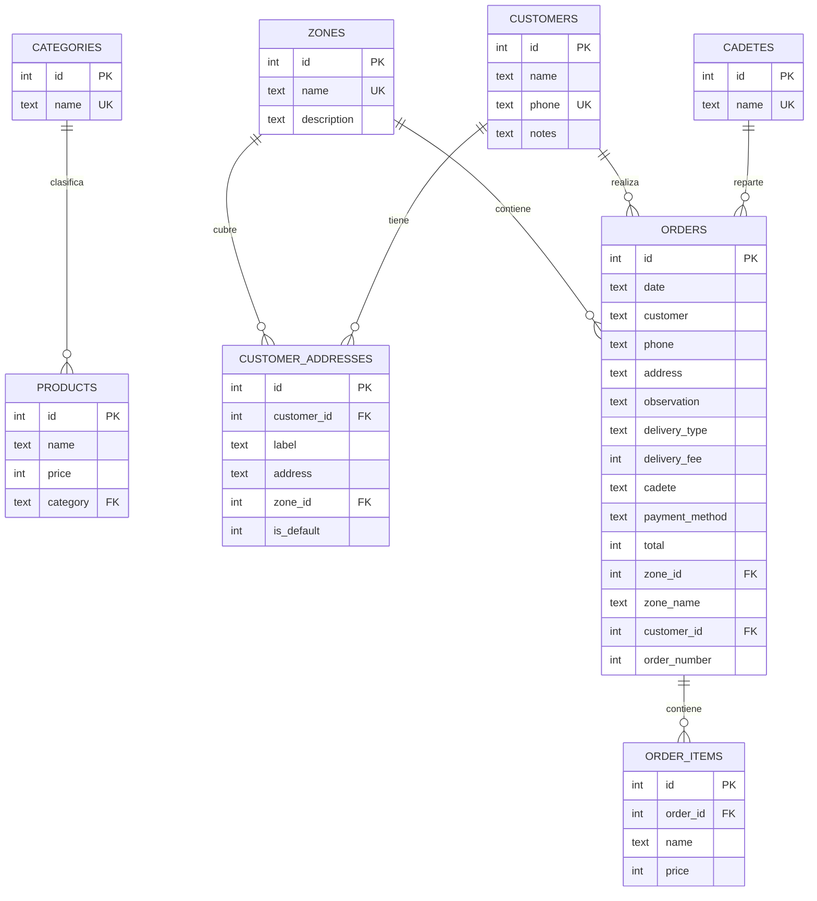

<h1 align="center">🍕 LPM Pizzas — Sistema de Gestión</h1>

<p align="center">
  <strong>Sistema integral de gestión para pizzerías · Pedidos · Impresión · Reportes fiscales</strong>
</p>

<p align="center">
  
  
  
  
</p>

<p align="center">
  
  
  
</p>

---

## 📋 Tabla de Contenidos

- [📖 Descripción](#-descripción)
- [✨ Funcionalidades](#-funcionalidades)
- [⚙️ Requisitos del Sistema](#️-requisitos-del-sistema)
- [📥 Instalación en una PC Nueva](#-instalación-en-una-pc-nueva)
- [🚀 Cómo Ejecutar el Sistema](#-cómo-ejecutar-el-sistema)
- [🏗️ Arquitectura del Proyecto](#️-arquitectura-del-proyecto)
- [🗃️ Estructura de la Base de Datos](#️-estructura-de-la-base-de-datos)
- [🖨️ Configuración de la Impresora](#️-configuración-de-la-impresora)
- [⚡ Configuración del Sistema (config.py)](#-configuración-del-sistema-configpy)
- [📖 Guía de Uso Rápido](#-guía-de-uso-rápido)
- [❓ FAQ / Solución de Problemas](#-faq--solución-de-problemas)

---

## 📖 Descripción

**LPM Pizzas** es un sistema de gestión completo diseñado para la operación diaria de una pizzería. Funciona desde la **consola de Windows** (ventana negra) y permite:

- 📝 Tomar pedidos de forma rápida y ágil
- 🖨️ Imprimir comandas de cocina y tickets de control automáticamente
- 🛵 Gestionar cadetes (repartidores) y sus liquidaciones diarias
- 💰 Generar reportes fiscales para **ARCA** (ex AFIP)
- 📊 Exportar datos a Excel (CSV)

> **📍 Dirección del negocio:** M.David 4304

El sistema está pensado para ser **simple de usar** — no necesitás ser programador. Solo hacés doble clic en `run_pizzeria.bat` y listo.

---

## ✨ Funcionalidades

| Módulo | Descripción |
|--------|-------------|
| 🍕 **Menú de Productos** | Gestión de productos y precios con categorías dinámicas y alineadas por ID |
| 📁 **Categorías** | CRUD de categorías (crear, renombrar, eliminar) dinámicas persistidas en la DB |
| 👥 **Clientes y Direcciones** | Base de datos de clientes, múltiples direcciones con etiquetas y asignación a zonas de reparto |
| 🗺️ **Zonas de Reparto** | Configuración de zonas de reparto y asignación a direcciones y pedidos |
| 📝 **Toma de Pedidos** | Búsqueda inteligente híbrida (por nombre, teléfono o ID real), soporte para `2 x muzza`, cantidades decimales (ej. `0.5 x docena`), pizzas mitad y mitad solo para pizzas grandes |
| 🛵 **Cadetes** | Alta/baja de repartidores, asignación a pedidos con envío |
| 💵 **Medios de Pago** | Registro de Efectivo (EF) y Online (ONL) por separado |
| 🖨️ **Impresión Doble** | **Comanda Cocina** con zona grande + **Ticket Control** (detalle completo) con corte automático |
| 📊 **Liquidación Diaria** | Cálculo automático: base de cadetes + comisiones de envío |
| 📈 **Reporte Fiscal** | Resumen de ventas por medio de pago y desglose por zonas (Listo para ARCA) |
| 📂 **Exportar a Excel** | Genera archivos `.csv` compatibles con Excel incluyendo columna de Zonas |
| 🔁 **Historial** | Búsqueda por cliente, cadete, medio de pago, zona de reparto o ID — Reimpresión de tickets |

---

## ⚙️ Requisitos del Sistema

| Requisito | Opción Ejecutable (`LpmPizzas.exe`) | Opción Python (`main.py`) |
|-----------|----------------------------------|---------------------------|
| 💻 **Sistema Operativo** | Windows 10 o Windows 11 | Windows 10 o Windows 11 |
| 🐍 **Python** | **NO requerido** (incluido dentro del ejecutable) | Versión 3.7 o superior |
| 🖨️ **Impresora** | Térmica de 80mm (POS80) (Opcional) | Térmica de 80mm (POS80) (Opcional) |
| 💾 **Espacio en disco** | Menos de 15 MB | Menos de 5 MB |
| 🌐 **Internet** | NO necesario (funciona 100% offline) | NO necesario (funciona 100% offline) |

> **📌 Nota:** El sistema no requiere instalar ninguna librería adicional de Python. Usa solo módulos incluidos con Python (sqlite3, csv, datetime, etc.).

---

## 📥 Instalación en una PC Nueva

### Paso 1: Descargar Python 🐍

1. Abrí el navegador y entrá a: **[https://www.python.org/downloads/](https://www.python.org/downloads/)**
2. Hacé clic en el botón amarillo grande que dice **"Download Python 3.x.x"**
3. Se va a descargar un archivo como `python-3.x.x-amd64.exe`

### Paso 2: Instalar Python ⚠️ MUY IMPORTANTE

Al abrir el instalador, vas a ver esta pantalla:

```
┌─────────────────────────────────────────────────────┐
│                                                     │
│           Install Python 3.x.x (64-bit)            │
│                                                     │
│  ☑  Install launcher for all users (recommended)    │
│  ☑  Add python.exe to PATH   ◄── ¡¡MARCAR ESTO!!   │
│                                                     │
│  ┌─────────────────────┐  ┌──────────────────────┐  │
│  │   Install Now       │  │  Customize install   │  │
│  └─────────────────────┘  └──────────────────────┘  │
│                                                     │
└─────────────────────────────────────────────────────┘
```

> ⚠️ **CRÍTICO:** Antes de hacer clic en "Install Now", **marcá la casilla que dice "Add python.exe to PATH"** (está abajo de todo). Si no la marcás, el sistema NO va a funcionar.

4. Hacé clic en **"Install Now"** y esperá a que termine
5. Cuando diga **"Setup was successful"**, cerrá el instalador

### Paso 3: Verificar que Python se instaló bien ✅

1. Abrí el menú de inicio de Windows
2. Escribí `cmd` y abrí **"Símbolo del sistema"**
3. Escribí el siguiente comando y presioná Enter:

```
python --version
```

```
┌──────────────────────────────────────────┐
│ C:\Users\TuNombre> python --version      │
│ Python 3.12.4                            │  ◄── Si ves esto, ¡funciona!
│                                          │
│ C:\Users\TuNombre>                       │
└──────────────────────────────────────────┘
```

> Si dice `"python" no se reconoce como un comando...` significa que no marcaste la casilla de PATH. Desinstalá Python y volvé a instalarlo marcando la casilla.

### Paso 4: Copiar los archivos del sistema 📂

1. Copiá **toda la carpeta** del proyecto a la nueva PC (por ejemplo al Escritorio)
2. La carpeta se llama `proyecto de la pizzeria` y contiene todos los archivos necesarios
3. **No muevas ni renombres** los archivos de adentro

### Paso 5: Configurar la impresora 🖨️

Seguí las instrucciones de la sección [Configuración de la Impresora](#️-configuración-de-la-impresora) más abajo.

---

## 🚀 Cómo Ejecutar el Sistema

### Opción A: Ejecutable Directo (Recomendado - Sin instalar Python)
Si querés llevar el programa a otra computadora de forma rápida:
1. Copiá la carpeta `dist/` a cualquier lugar de la PC.
2. Hacé **doble clic** directamente en el archivo executable:
   ```
   📁 dist/
     └── 📥 LpmPizzas.exe   ◄── Doble clic acá
   ```
*Nota: Este archivo incluye todas las dependencias y corre directo en cualquier Windows 10/11.*

### Opción B: Script con Python
Hacé **doble clic** en el script de arranque:
```
📁 proyecto de la pizzeria/
  └── 🟢 run_pizzeria.bat   ◄── Doble clic acá
```
O de forma manual desde terminal:
```bash
python main.py
```

Al iniciar vas a ver:

```
     __                      ____  _
    / /   ____  ____ ___    / __ \(_)____________________
   / /   / __ \/ __ `__ \  / /_/ / /_  /_  / / __ `/ ___/
  / /___/ /_/ / / / / / / / ____/ / / /_/ /_/ /_/ (__  )
 /_____/ .___/_/ /_/ /_/ /_/   /_/ /___/___/\__,_/____/
      /_/

--------------------------------------------------
         SISTEMA DE GESTION LPM PIZZAS
--------------------------------------------------
1. Ver Menu
2. Tomar Pedido
3. Administrar
4. Salir

Seleccione una opcion ([2]):
```

> 💡 **Tip:** El sistema arranca por defecto en "Tomar Pedido" (opción 2). Si presionás Enter directo, va a la toma de pedidos.

---

## 🏗️ Arquitectura del Proyecto

El proyecto utiliza una **Arquitectura por Capas** (Layered Architecture) que separa las responsabilidades en módulos independientes:



### 📁 Estructura de Archivos

```
proyecto de la pizzeria/
│
├── 🟢 main.py                    # Punto de entrada del sistema (~30 líneas)
├── ⚙️ config.py                   # Configuración centralizada (impresora, constantes)
│
├── 📦 domain/                     # Capa de Dominio (modelos de datos)
│   ├── __init__.py
│   ├── models.py                  # Dataclasses: Product, Category, OrderItem, Order
│   └── pricing.py                 # Reglas de precios (mitad y mitad, etc.)
│
├── 🔧 services/                   # Capa de Servicios (lógica de negocio)
│   ├── __init__.py
│   ├── order_service.py           # Crear pedidos, buscar, filtrar
│   ├── product_service.py         # Alta, baja y modificación de productos
│   ├── category_service.py        # Alta, baja y modificación de categorías
│   ├── cadete_service.py          # Alta, baja de cadetes (repartidores)
│   ├── report_service.py          # Liquidación diaria y reportes fiscales
│   └── export_service.py          # Exportación a CSV (Excel)
│
├── 🖥️ ui/                         # Capa de Presentación (interfaz de consola)
│   ├── __init__.py
│   ├── menus.py                   # Navegación del menú principal y submenús
│   ├── input_helpers.py           # Parseo de entrada (ej: "2 x muzza")
│   └── display.py                 # Header ASCII, formateo de tablas
│
├── 🗄️ infra/                      # Capa de Infraestructura
│   ├── __init__.py
│   ├── database.py                # Conexión y queries a SQLite
│   └── printer.py                 # Impresión ESC/POS (térmica 80mm) y PDF
│
├── 📂 data/                       # Carpeta de datos
│   └── 🗃️ pizzeria.db             # Base de datos SQLite (se crea automáticamente)
├── 📂 tickets/                    # Carpeta de comandas, tickets y reportes
├── 🖼️ logo_pizza.png              # Logo del negocio
├── 🟢 run_pizzeria.bat            # Script para iniciar con doble clic
└── 📄 README.md                   # Esta documentación
```

### 🔄 Flujo de un Pedido



---

## 🗃️ Estructura de la Base de Datos

El sistema utiliza **SQLite** como base de datos. El archivo `data/pizzeria.db` se crea automáticamente al iniciar por primera vez.

### Tabla `products` — Productos del menú

| Columna | Tipo | Descripción |
|---------|------|-------------|
| `id` | INTEGER (PK) | Identificador único, autoincremental |
| `name` | TEXT NOT NULL | Nombre del producto (máx. 30 caracteres) |
| `price` | INTEGER NOT NULL | Precio en pesos (sin decimales) |
| `category` | TEXT DEFAULT 'Pizza' | Categoría: `Pizza`, `Papas`, `Empanadas` o personalizadas |

### Tabla `categories` — Categorías de productos

| Columna | Tipo | Descripción |
|---------|------|-------------|
| `id` | INTEGER (PK) | Identificador único, autoincremental |
| `name` | TEXT NOT NULL UNIQUE | Nombre de la categoría (ej. Pizza) |

### Tabla `zones` — Zonas de reparto

| Columna | Tipo | Descripción |
|---------|------|-------------|
| `id` | INTEGER (PK) | Identificador único, autoincremental |
| `name` | TEXT NOT NULL UNIQUE | Nombre de la zona (ej. Zona 1) |
| `description` | TEXT | Calles o referencias de límites |

### Tabla `customers` — Clientes registrados

| Columna | Tipo | Descripción |
|---------|------|-------------|
| `id` | INTEGER (PK) | Identificador único, autoincremental |
| `name` | TEXT NOT NULL | Nombre y apellido del cliente |
| `phone` | TEXT UNIQUE | Teléfono principal (utilizado para búsqueda rápida) |
| `notes` | TEXT | Notas fijas o indicaciones de entrega |

### Tabla `customer_addresses` — Direcciones de los clientes

| Columna | Tipo | Descripción |
|---------|------|-------------|
| `id` | INTEGER (PK) | Identificador único, autoincremental |
| `customer_id` | INTEGER (FK) | ID del cliente (`customers.id`, cascade delete) |
| `label` | TEXT | Etiqueta (ej. Casa, Oficina, Trabajo) |
| `address` | TEXT NOT NULL | Dirección física (calle y altura) |
| `zone_id` | INTEGER (FK) | Zona de reparto asociada (`zones.id`) |
| `is_default` | INTEGER | `1` si es la dirección predeterminada, `0` en caso contrario |

### Tabla `orders` — Pedidos

| Columna | Tipo | Descripción |
|---------|------|-------------|
| `id` | INTEGER (PK) | Número de pedido, autoincremental |
| `date` | TEXT NOT NULL | Fecha y hora (`YYYY-MM-DD HH:MM:SS`) |
| `customer` | TEXT NOT NULL | Nombre del cliente (snapshot histórico) |
| `phone` | TEXT | Teléfono del cliente (snapshot histórico) |
| `address` | TEXT | Dirección de entrega (snapshot histórico) |
| `observation` | TEXT | Observaciones (ej: "sin cebolla") |
| `delivery_type` | TEXT NOT NULL | `Envío` o `Take Away` |
| `delivery_fee` | INTEGER DEFAULT 0 | Costo del envío en pesos |
| `cadete` | TEXT | Nombre del cadete asignado |
| `payment_method` | TEXT DEFAULT 'Efectivo' | `Efectivo` o `Online` |
| `total` | INTEGER NOT NULL | Total cobrado (productos + envío) |
| `zone_id` | INTEGER (FK) | Zona del pedido (`zones.id`, opcional) |
| `zone_name` | TEXT | Nombre de la zona al momento del pedido |
| `customer_id` | INTEGER (FK) | Referencia al cliente (`customers.id`, opcional) |
| `order_number` | INTEGER | Número de orden del día (secuencial corto, se reinicia cada jueves) |

### Tabla `order_items` — Detalle de cada pedido

| Columna | Tipo | Descripción |
|---------|------|-------------|
| `id` | INTEGER (PK) | Identificador único |
| `order_id` | INTEGER (FK) | Referencia a `orders.id` |
| `name` | TEXT NOT NULL | Nombre del producto al momento de la venta |
| `price` | INTEGER NOT NULL | Precio unitario al momento de la venta |

### Tabla `cadetes` — Repartidores

| Columna | Tipo | Descripción |
|---------|------|-------------|
| `id` | INTEGER (PK) | Identificador único |
| `name` | TEXT NOT NULL UNIQUE | Nombre del cadete |

### Diagrama de relaciones



---

## 🖨️ Configuración de la Impresora

### ¿Qué impresora necesito?

El sistema está diseñado para impresoras térmicas de **80mm** (como las de un comercio o restaurante). El modelo recomendado es cualquiera compatible con comandos **ESC/POS**.

### Paso a paso para configurar la impresora ⚠️ CRÍTICO

#### 1. Instalar la impresora en Windows

Conectá la impresora por USB e instalá los drivers que vienen con ella. Windows debería reconocerla automáticamente.

#### 2. Compartir la impresora como "POS80"

Este paso es **obligatorio** para que el sistema pueda imprimir:

```
┌─────────────────────────────────────────────────────────┐
│                                                         │
│  1. Abrí  Configuración → Dispositivos → Impresoras    │
│                                                         │
│  2. Buscá tu impresora térmica en la lista              │
│                                                         │
│  3. Clic derecho → "Propiedades de la impresora"        │
│                                                         │
│  4. Pestaña "Compartir"                                 │
│     ☑ Compartir esta impresora                          │
│     Nombre del recurso: [ POS80 ]  ◄── EXACTO así      │
│                                                         │
│  5. Clic en "Aceptar"                                   │
│                                                         │
└─────────────────────────────────────────────────────────┘
```

> ⚠️ **El nombre DEBE ser exactamente `POS80`** (en mayúsculas, sin espacios). El sistema envía la impresión al recurso compartido `\\127.0.0.1\POS80`.

#### 3. Verificar que funciona

Abrí una ventana de **cmd** (Símbolo del sistema) y escribí:

```
echo Prueba de impresion > test.txt
copy /b test.txt "\\127.0.0.1\POS80"
```

Si la impresora imprime "Prueba de impresion", ¡está todo listo! 🎉

---

## ⚡ Configuración del Sistema (`config.py`)

El archivo `config.py` contiene todas las configuraciones centralizadas del sistema. Los ajustes más importantes son:

### 🖨️ Modo de Impresión (`OUTPUT_MODE`)

Este es el ajuste **más importante** que vas a tener que cambiar:

```python
# =====================================================
# CONFIGURACION DE SALIDA DE IMPRESIÓN
# =====================================================
# Opciones:
#   'POS80'  → Impresora térmica real (para el local)
#   'PDF'    → Abre ventana de Windows para guardar PDF
#   'DEBUG'  → Solo muestra en la pantalla negra (para probar)
# =====================================================
OUTPUT_MODE = 'PDF'     # ◄── Cambiá esto según tu necesidad
```

| Modo | ¿Cuándo usarlo? | ¿Qué hace? |
|------|-----------------|------------|
| `'POS80'` | **En el local** con la impresora conectada | Envía directo a la impresora térmica, con corte automático de papel |
| `'PDF'` | Para **probar** sin impresora | Abre la ventana de Windows para guardar como PDF |
| `'DEBUG'` | Para **desarrollo** | Solo muestra una vista previa en la consola (no genera archivos) |

#### ¿Cómo cambiar el modo?

1. Abrí el archivo `config.py` con el **Bloc de notas** (clic derecho → Abrir con → Bloc de notas)
2. Buscá la línea que dice `OUTPUT_MODE = 'PDF'`
3. Cambiá `'PDF'` por `'POS80'` (con comillas simples)
4. Guardá el archivo (Ctrl + S)
5. Reiniciá el sistema (cerrá y volvé a abrir `run_pizzeria.bat`)

```python
# ANTES (modo prueba):
OUTPUT_MODE = 'PDF'

# DESPUÉS (modo producción con impresora):
OUTPUT_MODE = 'POS80'
```

### 💰 Configuración de Cadetes

```python
# Pago base diario por cadete (en pesos)
BASE_PAY_CADETE = 10000
```

### 🖨️ Ancho de Impresión

```python
# Ancho de ticket en caracteres (80mm = 48 chars)
PRINTER_WIDTH = 48
```

### 📍 Datos del Negocio

```python
BUSINESS_NAME = "LPM PIZZAS"
BUSINESS_ADDRESS = "M.David 4304"
```

---

## 📖 Guía de Uso Rápido

### 🍕 Tomar un Pedido (el flujo más importante)

```
1. Abrí el sistema (doble clic en run_pizzeria.bat)
2. Presioná Enter (va directo a "Tomar Pedido")
3. Escribí el nombre del cliente
4. Escribí teléfono y dirección (opcionales)
5. Elegí tipo de entrega: 1=Envío, 2=Take Away
6. Si es envío, ingresá el costo del envío
```

**Agregar productos al pedido:**
```
Producto: muzza          → Busca y agrega 1 muzzarella
Producto: 2 x napo       → Agrega 2 napolitanas
Producto: 3x fugazzeta   → Agrega 3 fugazzetas
Producto: 5              → Agrega el producto #5 del menú
Producto: mitad           → Activa el modo "mitad y mitad"
Producto: menu            → Muestra el menú completo
Producto: fin             → Termina de agregar productos
```

```
7. Escribí observaciones si las hay (ej: "sin cebolla")
8. Si es envío, seleccioná el cadete
9. Elegí medio de pago: 1=Efectivo, 2=Online
10. ¡Listo! Se imprimen la comanda y el ticket automáticamente
```

### 📊 Ver la Liquidación de Cadetes

```
Menú principal → 3 (Administrar) → 2 (Reportes) → 2 (Liquidación)
```

Muestra una tabla con:
```
Cadete              Envios   Comision   Base       Total
─────────────────────────────────────────────────────────
Juan                5        $7500      $10000     $17500
María               3        $4500      $10000     $14500
```

### 📈 Generar Reporte Fiscal (ARCA)

```
Menú principal → 3 (Administrar) → 2 (Reportes) → 3 (Resumen de Ventas)
```

Permite ver:
- Ventas de **hoy**
- Ventas de un **día específico**
- Ventas de un **mes completo**
- **Todo el historial**

Separa automáticamente **Efectivo** vs **Online** para declarar en ARCA.

### 📂 Exportar a Excel

```
Menú principal → 3 (Administrar) → 3 (Exportar a Excel)
```

Genera un archivo `.csv` que se abre perfectamente en Excel con:
- Separador `;` (punto y coma) — Compatible con Excel en español
- Encoding `utf-8-sig` — Para que los acentos y la ñ se vean bien
- Columnas: ID, Fecha, Cliente, Teléfono, Dirección, Tipo Entrega, Envío, Cadete, Método Pago, Total, Items

---

## ❓ FAQ / Solución de Problemas

### 🔴 "python no se reconoce como un comando"

**Causa:** Python no se agregó al PATH durante la instalación.

**Solución:**
1. Desinstalá Python desde **Configuración → Aplicaciones**
2. Volvé a instalar Python marcando **"Add python.exe to PATH"**
3. Reiniciá la computadora

---

### 🔴 La impresora no imprime / "No se pudo copiar el archivo"

**Causa:** La impresora no está compartida correctamente.

**Solución:**
1. Verificá que la impresora esté compartida con el nombre exacto **`POS80`**
2. Abrí `cmd` y probá: `copy /b test.txt "\\127.0.0.1\POS80"`
3. Verificá que `OUTPUT_MODE` esté en `'POS80'` en `config.py`

---

### 🔴 El ticket sale con el texto chico o con márgenes

**Causa:** La impresora está usando el driver de Windows en vez del modo RAW.

**Solución:** El sistema usa `copy /b` (modo RAW binario) para enviar los datos directamente. Asegurate de que la impresora esté compartida como **POS80** y no estés usando "Imprimir" de Windows.

---

### 🔴 Al abrir el CSV en Excel, los acentos se ven raro (á en vez de á)

**Causa:** Excel no reconoció la codificación del archivo.

**Solución:** El sistema ya genera los CSV con encoding `utf-8-sig` (BOM), lo que debería funcionar automáticamente. Si aún así se ven mal:
1. Abrí Excel
2. Pestaña **Datos → Obtener datos → Desde archivo de texto**
3. Seleccioná el archivo `.csv`
4. En la ventana de importación, elegí codificación **UTF-8**
5. Separador: **Punto y coma**

---

### 🔴 Se me cerró el sistema y perdí datos

**No te preocupes.** Los datos se guardan automáticamente en `data/pizzeria.db` después de cada operación. Al volver a abrir el sistema, todo tu historial va a seguir ahí.

---

### 🟡 ¿Cómo cambio los precios de los productos?

```
Menú principal → 3 (Administrar) → 1 (Gestión) → 1 (Productos) → 2 (Editar)
```

---

### 🟡 ¿Puedo agregar un nuevo tipo de producto (no solo pizza)?

Sí, podés agregar todos los que quieras. El sistema soporta categorías dinámicas persistidas en la base de datos. Por defecto viene con:
- 🍕 **Pizza**
- 🍟 **Papas**
- 🥟 **Empanadas**

Pero podés crear, renombrar o eliminar categorías libremente desde el menú:
```
Menú principal → 3 (Administrar) → 1 (Gestión) → 3 (Categorías)
```
Al agregar un producto, el sistema te preguntará en cuál de las categorías activas deseas colocarlo.

---

### 🟡 ¿Qué pasa si borro un cadete que ya tiene pedidos?

Los pedidos anteriores conservan el nombre del cadete en su registro. La liquidación del día mostrará a cadetes eliminados con la etiqueta **(ELIMINADO)** si tienen entregas ese día.

---

### 🟡 ¿Puedo usar el sistema sin impresora?

¡Sí! Cambiá `OUTPUT_MODE` a `'PDF'` o `'DEBUG'` en `config.py`:
- **PDF**: Abre la ventana de Windows para "imprimir" (podés guardar como PDF)
- **DEBUG**: Solo muestra el ticket en la pantalla negra

---

### 🟡 ¿Dónde se guardan los datos?

En el archivo `data/pizzeria.db` que está dentro de la carpeta `data/` del sistema. Es un archivo de base de datos SQLite. **No lo borres ni borres su carpeta** — ahí está todo el historial de pedidos, productos y cadetes.

---

## 📄 Licencia

Este proyecto se distribuye bajo los términos de una **Licencia Híbrida**:
- **Uso Personal y Educativo**: Completamente **gratuito**. Podés ver, modificar, experimentar y usar el código para aprender o para tu portafolio personal (siempre atribuyendo la autoría original).
- **Uso Comercial / Producción**: Si querés usar este sistema para la gestión real de tu negocio o implementarlo para un tercero, se requiere adquirir una **Licencia Comercial**. Por favor ponte en contacto con el autor para adquirirla.

Para ver los términos detallados, consulta el archivo [LICENSE](LICENSE).

---

<p align="center">
  <strong>🍕 Hecho con 🧡 para LPM Pizzas — M.David 4304 🍕</strong>
</p>

<p align="center">
  <sub>Sistema de Gestión v2.0 · Arquitectura por Capas · Python 3 + SQLite</sub>
</p>
